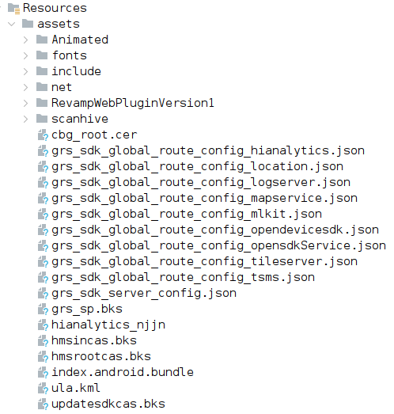
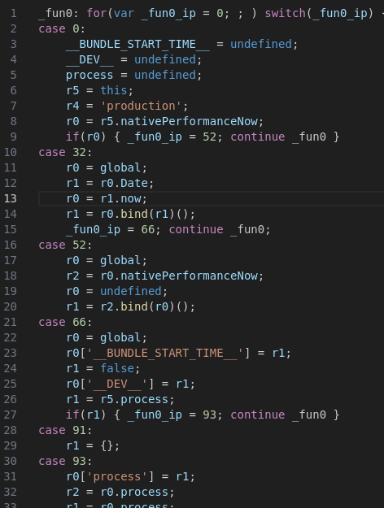
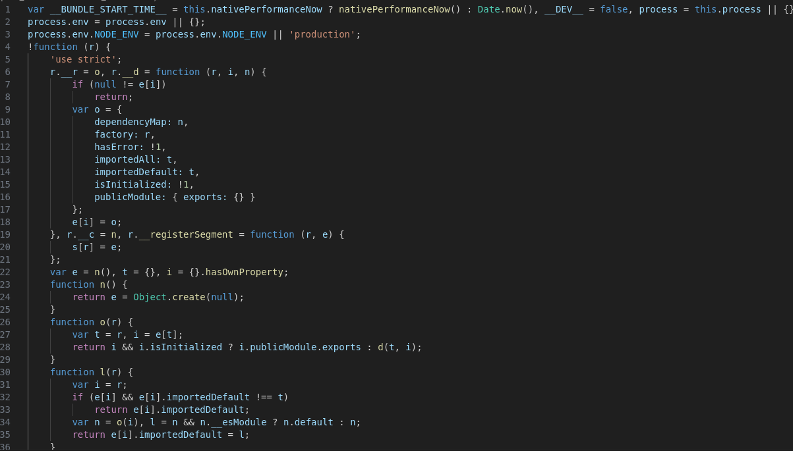
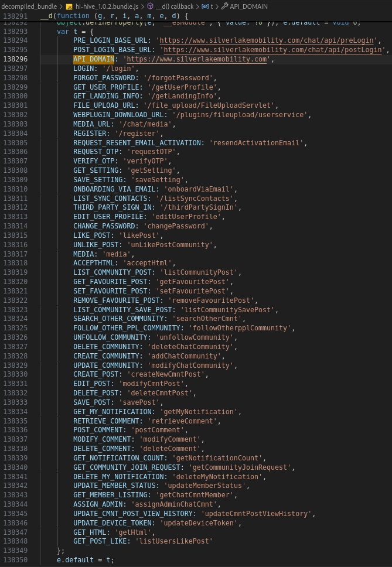

During COVID-19, my university debuted an attendance tracking called Hi-Hive Community. A lecturer would present a QR code, and the students will scan it to take attendance.

After using the application for a few years, I noticed that it was too bloated with unnecessary features, it's not very responsive, and important items are buried in unending levels of menus.

Thus, I have the idea of rebuilding the application using Kotlin, Jetpack Compose, and more modern UI frameworks.

To do so, I first needed to figure how the API works.

# Preliminary Analysis
Through regular usage, I suspected that it uses some kind of web/mobile hybrid framework. 

Some symptoms I've noticed are:
1. **Slow and slightly off user interface** - There will be slight delays when tapping on elements, animation is slow, and low frame rates at times.
2. **Lack of uniformity in the components** - A lot of the components seems custom made. There are a mix of native elements with custom ones.
3. **Existence of web-view pages** - Some of the functions are loaded through webview.

All in all it _feels_ like using a website. My gut feelings tell me that it's a web/mobile hybrid framework. Most likely using React Native.

# Dissecting the Application
The only method to really confirm this is by cracking it open and have a look at the internals. Here, we will be using version `2.3.1` of the application downloaded from [ApkPure](https://apkpure.com/hi-hive-community/com.slc.hihive.community).

## Unpacking the `.apk`
I unpacked the .apk using `jadx` and immediately there are telltale signs of React Native.

For example, this image below shows configuration for a react native push notification library.

Which upon further investigation, it appears that this was the library used: https://github.com/zo0r/react-native-push-notification. It's a React Native library.

## Checking for presence of `index.android.bundle`

Furthermore, there is also presence of `index.android.bundle` as seen below.

The `index.android.bundle` contains compiled and bundled JavaScript code for the application. Only React Native bundles this.

## Disassembling Hermes Bytecode
Immediately, I tried to open the bundle using a text editor but it showed an error. 

After a google search, I found out that Hermes VM is the default compilation target for more recent versions of React Native. Which is confirmed by the `file` command:

Fortunately, [P1 Security](https://www.p1sec.com/blog/releasing-hermes-dec-an-open-source-disassembler-and-decompiler-for-the-react-native-hermes-bytecode) released a tool to disassemble, and decompile Hermes bytecodes.

Using the tool ([hermes-dec](https://github.com/P1sec/hermes-dec/)), I disassembled the Hermes bytecode into somewhat readable pseudo-javascript.

However this is still super unreadable, due to it being converted from `javascript` to `obfuscated javascript` to `hermes bytecode` to `decompiled WASM` to `javascript pseudocode`. 

This meant that it's a "readable" version of the WASM instructions, not how the original code is structured.

Ideally, we want to get the version of tthe application that converted `javascript` to `obfuscated javascript` which should be more readable, and actually represent the original code.

## Back to the square one and cracking an older version
The `hermes-dec` project README states that React Native only started targetting the Hermes VM by default after React Native v0.70.

I thought, _what if the targetting of Hermes VM isn't actually on purpose by the developer?_ So I grabbed version `1.0.2` of the application which was released before React Native v.70, and cracked it open.

As predicted! The `index.android.bundle` file is only obfuscated Javascript, not Hermes bytecode!

This is a more readable version of the `index.android.bundle` file compared to the one from version `2.3.1`, not by much but it's still better than nothing.

What this means is that we now have a base from which to reverse engineer the API used by the application.

# Reversing and mapping the API
After a bit of searching, I found the following parts. It seems to be an object containing all the API domain, and paths.

> NOTE: Through comparing v1.0.2 and v2.3.1, I found out that `API_DOMAIN` is not pointing to `www.silverlakemobility.com` anymore, it is now pointing to `www.hi-hive.com`.

To implement the application, we only need to figure out some of the endpoints. 

The API endpoints relevant to us are:

- Authentication
- Listing classes, and attendance
- Scanning QR codes

With these, we can start mapping the needed endpoints and figure out what to pass to it.

## Authentication

## Listing classes, and attendance

## Scanning QR Codes

# Roadblock to putting together a 3rd party library

# Other Methods

# Conclusion